# Renewable Energy Resource Optimization Using AI

Maximizing energy production and efficiency in solar and wind farms using machine learning, explainable AI, and optimization.
M.Sc. Data Science project, Vellore Institute of Technology (VIT). Case study: Addis Ababa, Ethiopia.

## Objective
Rapid urbanization, industrial growth, and climate change are increasing demand for renewable energy. Because solar radiation and wind speed vary, generation is hard to predict and plan for. This project uses AI and machine learning to:
- Forecast solar radiation (GHI, DNI)
- Identify the factors that drive solar panel efficiency and find the optimal panel tilt angle
- Estimate wind power potential and its daily and seasonal patterns
- Optimize energy storage and grid distribution
- Classify days by generation conditions to support planning

## Data
**Source:** National Solar Radiation Database (NSRDB), Africa region, Addis Ababa (17+ years of historical data).

**Key attributes**
- **Global Horizontal Irradiance (GHI):** total solar radiation on a horizontal surface (direct + diffuse)
- **Direct Normal Irradiance (DNI):** radiation perpendicular to the sun's rays, critical for panel efficiency
- **Diffuse Horizontal Irradiance (DHI):** scattered radiation, important in cloudy conditions
- **Environmental factors:** temperature, relative humidity, wind speed and direction, cloud cover, surface albedo, solar zenith angle

## Methodology
1. **Preprocessing:** interpolation for missing values, Z-score outlier removal, Min-Max scaling, time-based features (hour, day, month, season)
2. **Exploratory analysis:** correlation analysis, hourly/monthly trends, irradiance components over time
3. **Predictive modeling:** LSTM, XGBoost, and Random Forest (80:20 split), evaluated with R², RMSE, and MAE
4. **Solar efficiency optimization:** SHAP analysis for feature impact; Genetic Algorithm and pvlib for the optimal tilt angle
5. **Wind energy analysis:** wind power from P = ½ · ρ · A · Cp · V³ (rotor area 7,854 m², Cp = 0.35), wind rose, seasonal and hourly patterns
6. **Storage and grid optimization:** Linear Programming model to manage storage and distribution and minimize energy loss
7. **Weather clustering:** K-Means (k = 3 via the Elbow Method) to label days as Ideal, Moderate, or Poor for generation

## Exploratory Data Analysis

### Correlation between solar radiation and weather factors
GHI and DHI are almost perfectly correlated (0.98); humidity is negatively correlated with all radiation components.

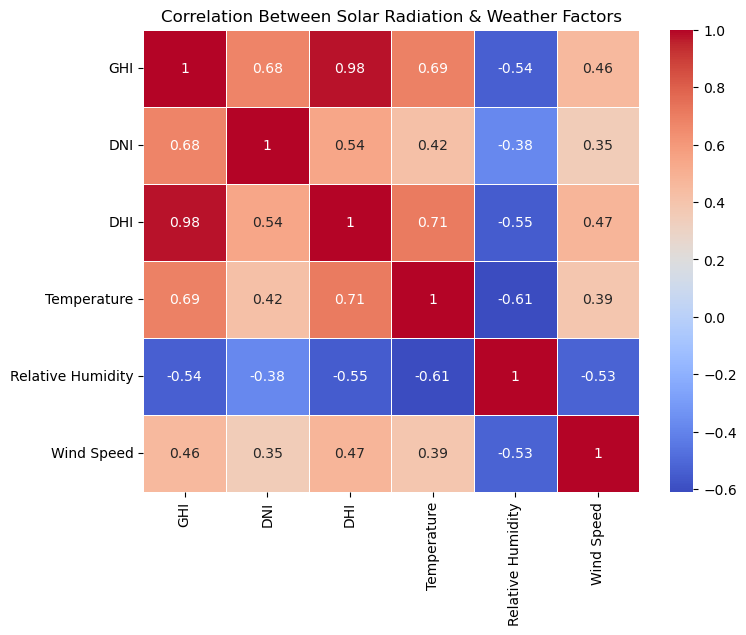

### Hourly and monthly solar radiation
Radiation peaks in the late morning and is highest in the middle months of the year.

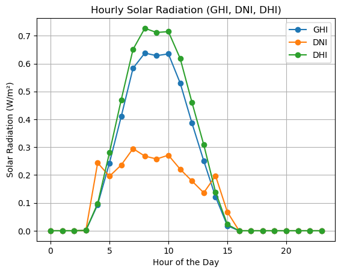
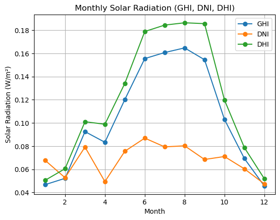

### Irradiance components over time
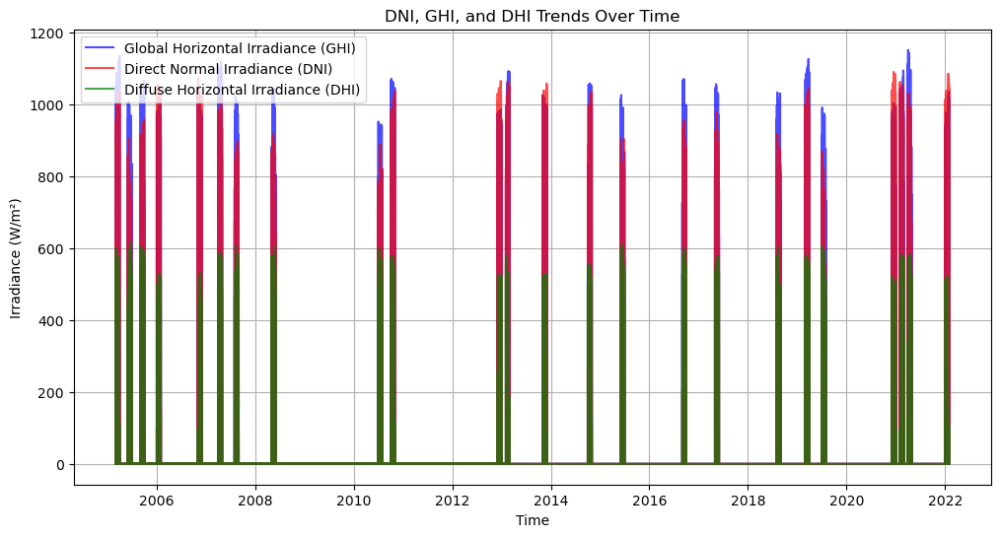

## Solar Efficiency Optimization

### SHAP analysis
Relative humidity and solar zenith angle have the largest impact on model output.

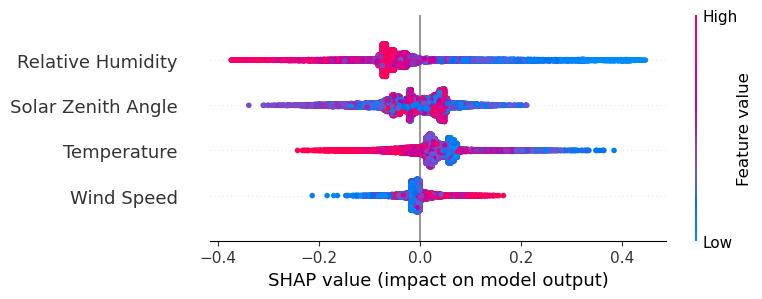

### Optimal panel tilt angle
A Genetic Algorithm identified **45°** as the optimal tilt angle for maximizing irradiance absorption.

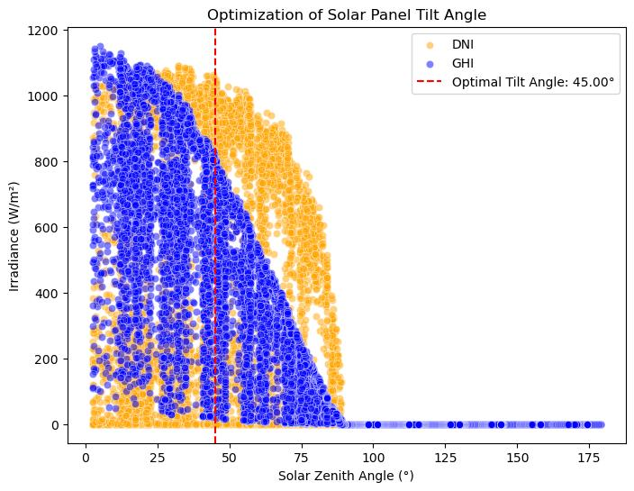

## Wind Energy Analysis

### Wind rose
Most wind flows between 90° and 180° (east to south), which supports turbine alignment decisions.

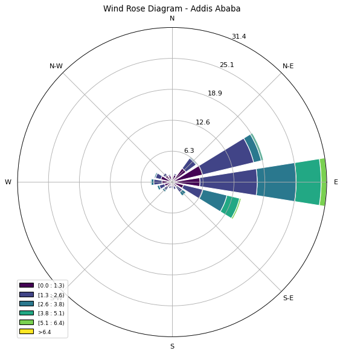

### Seasonal and hourly wind power
Wind power is highest in the dry and pre-rainy months and rises during the day, which complements solar generation.

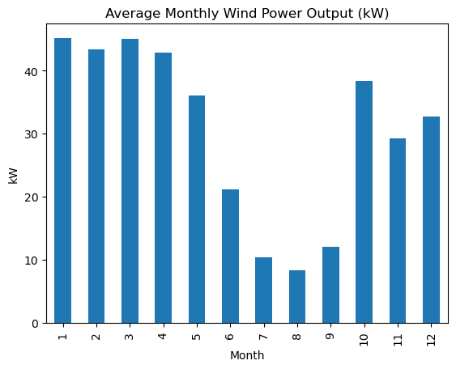
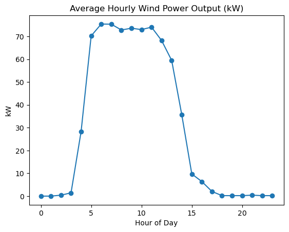

## Storage, Grid, and Hybrid System Optimization

### Energy storage and grid distribution (Linear Programming)
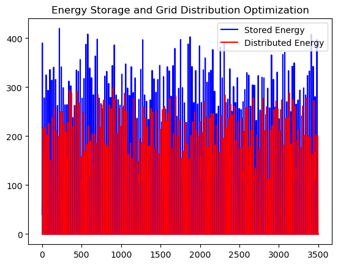

### Hybrid solar + wind system
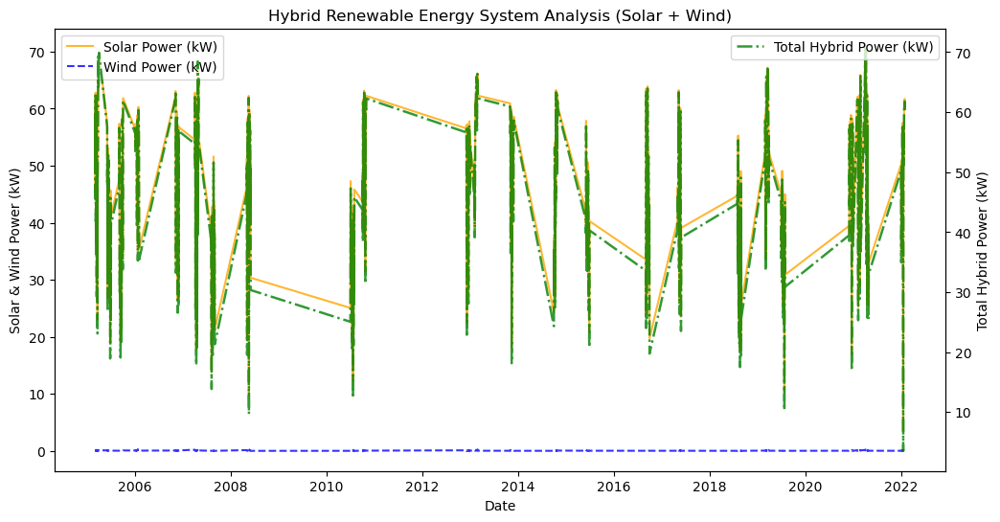

## Weather Clustering
The Elbow Method gave k = 3 clusters, used to label days as **Ideal**, **Moderate**, or **Poor** for energy generation.

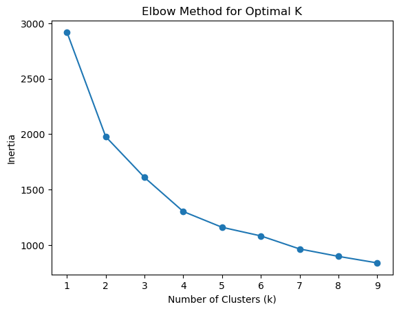

## Key Findings
- Solar radiation follows strong daily and seasonal cycles, peaking in the late morning and mid-year months.
- Humidity and solar zenith angle are the main drivers of solar efficiency; the optimal tilt angle is 45°.
- Wind generation peaks at different times from solar, so a hybrid system improves reliability.
- Linear Programming balances storage and grid supply to reduce energy loss.
- Clustering days by weather conditions supports storage, dispatch, and maintenance planning.

## Future Scope
- Reinforcement learning and real-time sensor data
- Extending the framework to other regions and battery storage strategies

## Repository Contents
| File | Description |
|---|---|
| `c_prepocessing.pdf` | Data preprocessing |
| `c_predictive_modeling.pdf` | Forecasting models |
| `c_shapanalysis.pdf` | SHAP analysis |
| `c_solarefficiency.pdf` | Solar efficiency and tilt optimization |
| `c_renewableenergy_opt.pdf` | Storage and grid optimization |
| `C_hybridmodel.pdf` | Hybrid solar and wind system |
| `solardata_addis.xlsx` | Solar and weather data for Addis Ababa |
| `*.png` | Charts used in this README |

## Tools
Python (pandas, NumPy, scikit-learn, XGBoost, TensorFlow/Keras, SHAP, pvlib, SciPy/PuLP), Matplotlib, Seaborn

## Author
Greeshma C, under the guidance of Dr. Umakanta Mishra, Department of Mathematics, School of Advanced Sciences, VIT
